# TicketRush

[](https://github.com/kanwal-codes/ticketrush/actions/workflows/ci.yml)

Flash-sale ticketing that stays correct under a traffic spike: a waiting room, live seat maps, timed seat holds, and zero oversold seats, backed by a published load test.

> End to end: sign-in and account recovery, the event and seat catalog, seat holds, the waiting room, checkout and tickets, cancellations and refunds, the organizer console, email, and a load test with published results. It is live at https://ticketrush-web.fly.dev ([how it is deployed](docs/deploy.md)) — demo data, and payments are in Stripe's test mode (no real charge is ever made; see [what it would still take to open this to the public](docs/adr/0009-ready-for-the-public.md)).

## System design

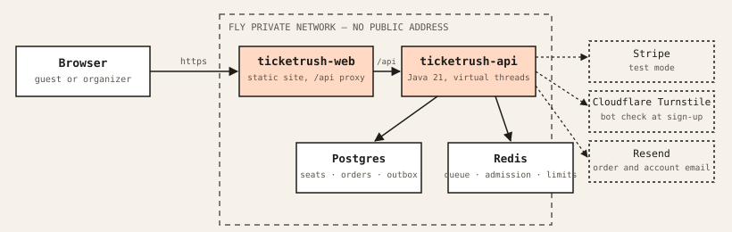

The interesting problems here are the ones that only show up under concurrency, and each is settled by a test that
creates the race on purpose rather than by reasoning about it after the fact:

| Problem | How it is solved | Proven by |
|---|---|---|
| **No seat is ever sold twice** | One conditional `UPDATE … WHERE status = 'AVAILABLE'` per seat, the database's own row lock as the only coordination — no distributed lock, no queue to serialize on | 300 guests claim one seat at the same instant: exactly one wins, every run. [ADR 0001](docs/adr/0001-seat-claims.md) |
| **A fair line under load, not a stampede** | Guests join a queue in Redis; one admission round a second lets a fixed number in, shared across every app instance so horizontal scaling can't break the order | 200 guests joining at once get places 1–200 with no gaps or repeats; 8 simultaneous admission rounds admit exactly the cap, in order. [ADR 0002](docs/adr/0002-waiting-room.md) |
| **A card is never charged twice** | Money never moves inside a database transaction. Three independent layers instead: the client's idempotency key, one live order per seat hold, and a key derived from the order at the payment provider | 10 identical requests at once produce one order and one charge; an unknown outcome (a timeout) is resolved later by a reconciler that looks the charge up, never retries blindly. [ADR 0003](docs/adr/0003-checkout-and-payments.md) |
| **A confirmation is never lost, never duplicated** | Paying writes an outbox row in the same transaction as the payment. A relay delivers each row to idempotent listeners and retries what fails, instead of sending the email inline and hoping | Killing the relay mid-delivery and restarting it delivers each confirmation exactly once. [ADR 0003](docs/adr/0003-checkout-and-payments.md) |

That reasoning, and what changed after a 1,500-guest load test found it wanting, is written down as it happened in
[docs/adr](docs/adr) — nine decision records, each with the alternatives considered and why they lost. The four rows
above are the headline problems; the longer, harder-to-skim list — every declined card, timeout, dropped connection,
expired token and race condition the app is tested against, each pointing at the test that proves it — is in
[**docs/edge-cases.md**](docs/edge-cases.md). The [load test results](docs/performance.md) are below, and the
[security record](docs/adr/0009-ready-for-the-public.md) covers what a scan of both images, the repository and the
running app found and how it was fixed.

## Stack

- **Backend:** Java 21 (virtual threads), Spring Boot 4, Spring Security with JWT, PostgreSQL 16, Redis 7, Flyway
- **Payments, bots and email:** Stripe (test mode; a mock provider stands in otherwise), Cloudflare Turnstile at sign-up, Resend for transactional email
- **Deployment:** Docker images, nginx, Fly.io (two apps, the API private), a smoke test for what must be closed
- **Frontend:** React 19, TypeScript (strict), Vite, React Router, TanStack Query, plain CSS, served by nginx. Types are generated from the backend's OpenAPI document
- **Quality:** JUnit 5, Testcontainers, ArchUnit, JaCoCo (93% of lines / 82% of branches, gated), Vitest and Testing Library, Playwright and axe, k6, Prometheus and Grafana, GitHub Actions
- **Security:** Trivy scans of both images and the repository, a ZAP baseline scan of the running app, and a test that every endpoint's access rules agree with a single list of who may call it — all on every pull request and weekly

## Run locally

You need Java 21, Docker and Maven (the wrapper is included).

```bash
cp .env.example .env     # then set the passwords and JWT_SECRET
docker compose up -d     # Postgres on 5433, Redis on 6379

set -a && . ./.env && set +a
cd backend && SPRING_PROFILES_ACTIVE=dev ./mvnw spring-boot:run
```

The `dev` profile creates demo data on first start: an organizer (`organizer@ticketrush.dev`, password from `DEMO_ORGANIZER_PASSWORD`), eight venues in three cities and thirteen published events, in every sale state (a drop hours away, a live queue, open sales). A database that has the first five gets the rest added once. Leave the profile off for an empty database.

Then the web app, in another terminal (needs Node 24):

```bash
cd frontend && npm install && npm run dev      # http://localhost:5173, forwards /api to the backend
```

- API docs: http://localhost:8080/swagger-ui/index.html
- Try it: `curl "localhost:8080/api/events?city=montreal"`

Postgres uses port 5433 so it does not clash with one already running on 5432. Health and Prometheus metrics are on a separate management port: `localhost:8081/actuator/health`.

To run everything in containers instead, with the backend capped at 2 CPUs and 1 GB so measurements mean something:

```bash
docker compose --profile app --profile web up -d --build           # backend and the web app as nginx serves it: http://localhost:8088
docker compose --profile app --profile monitoring up -d --build    # backend with Prometheus and Grafana (localhost:3000, dashboard "TicketRush")
```

## Tests

```bash
cd backend && ./mvnw verify                     # backend: unit, integration (Testcontainers), architecture
cd frontend && npm test                          # web app: unit and component tests
cd frontend && npm run e2e                       # web app: a real browser against a running stack (below)
```

The end-to-end tests drive Chromium against the real backend and database, so start the backend with
`SPRING_PROFILES_ACTIVE=dev,loadtest` and give the tests the demo organizer's password
(`ORGANIZER_PASSWORD=...`). They cover the whole purchase, a declined card, an unknown payment outcome, two guests
racing for the same seats, refreshing mid-queue, the whole purchase by keyboard, failures made on purpose (a failing server, a
missing page, a rate limit, going offline), reduced motion, layout shift, accessibility scans of every
screen, running a whole event as an organizer (create, publish, a guest buys, the dashboard agrees to the cent, the door
scanner admits once), and that no screen scrolls sideways on a phone.

Integration tests start real Postgres and Redis containers with Testcontainers, so Docker must be running. The build also writes a JaCoCo coverage report and fails if line coverage drops below 93% or branch coverage below 82%.

## What it looks like

| | |
|---|---|
| 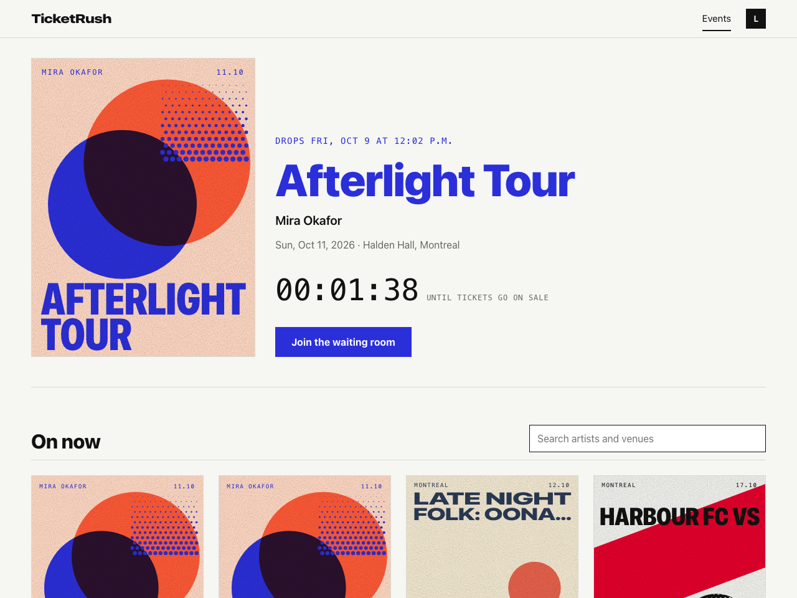 | 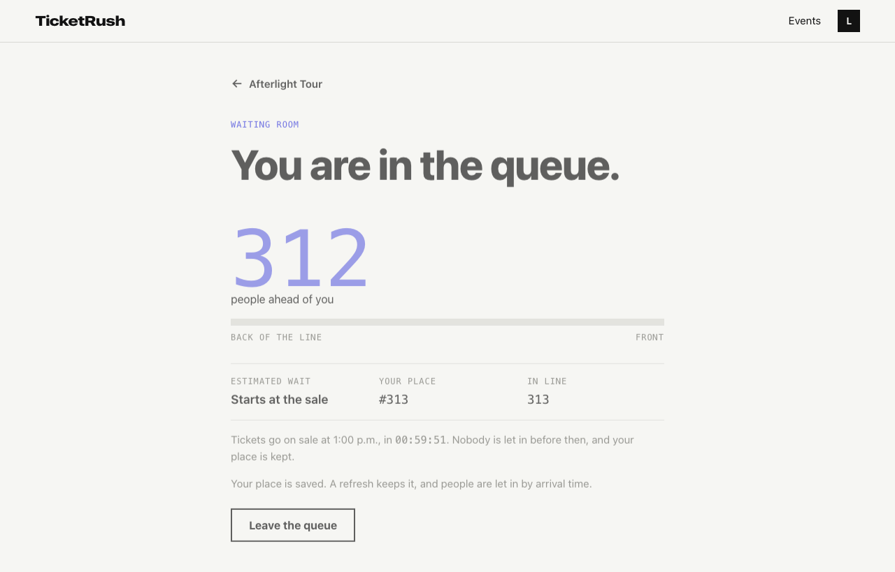 |
| The home page: the sale people are waiting for, with a countdown on the server's clock | The waiting room: an exact place that survives a refresh |
| 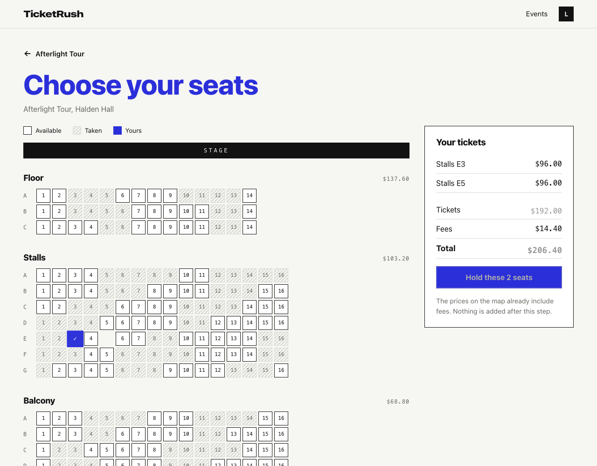 | 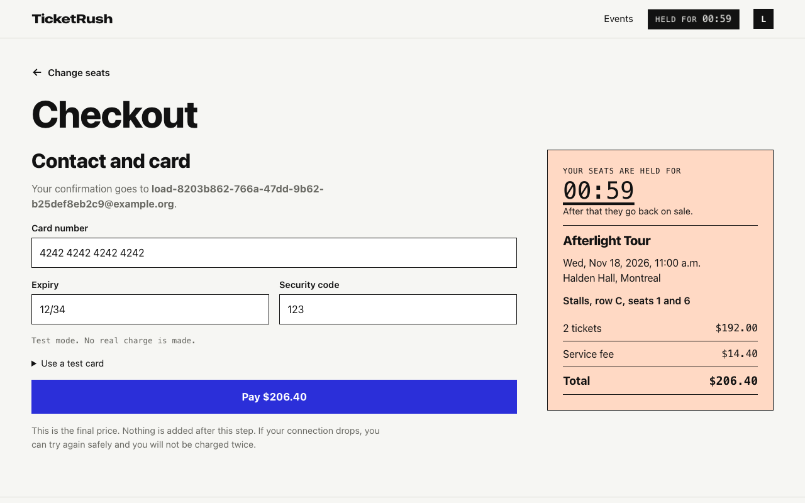 |
| The seat map, with the same totals the order will have | Checkout: the final price, and a retry that cannot charge twice |

<p>
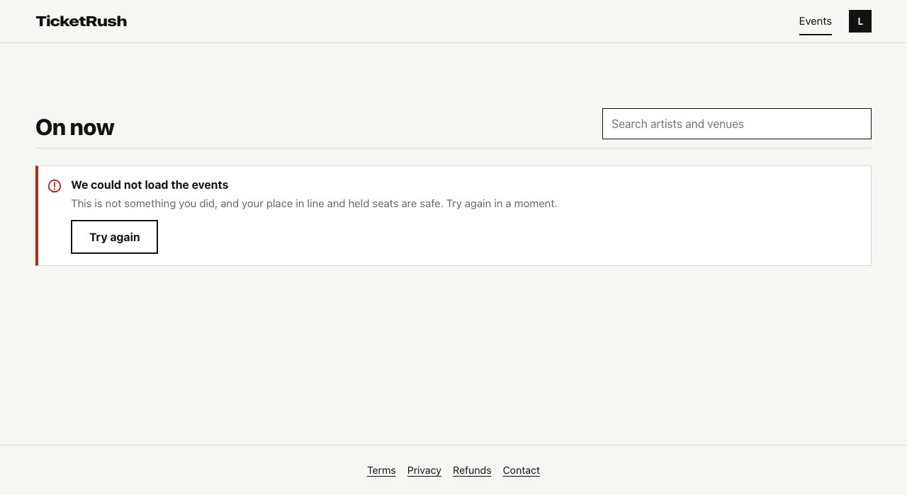
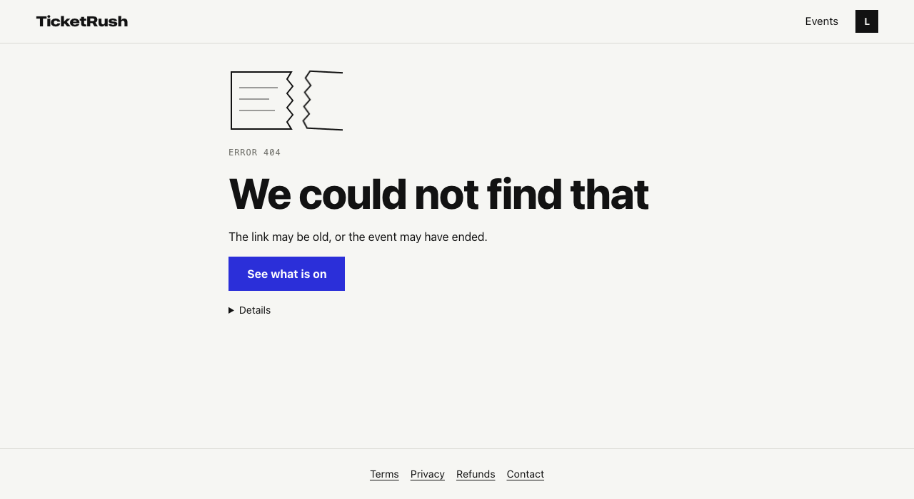
</p>

### The organizer console

<p>
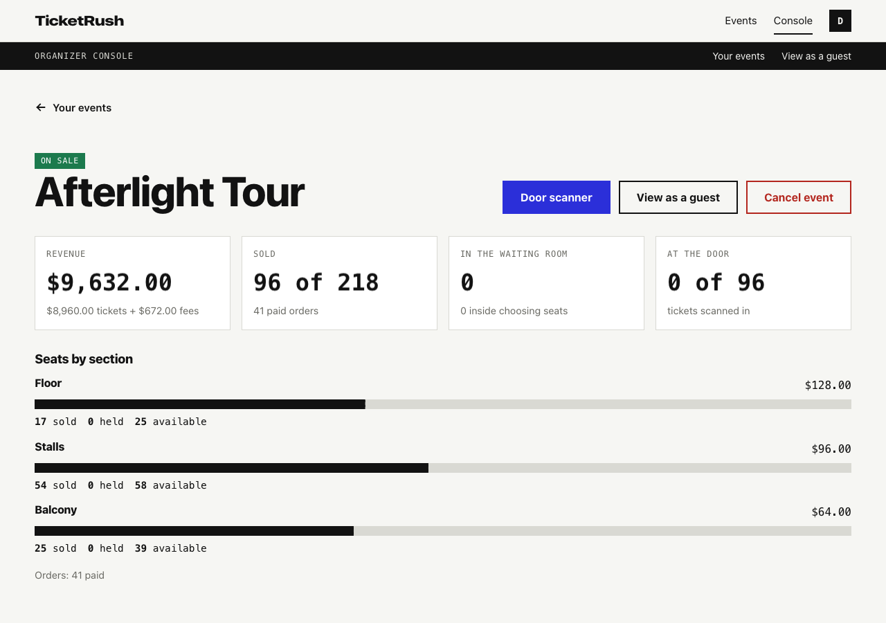
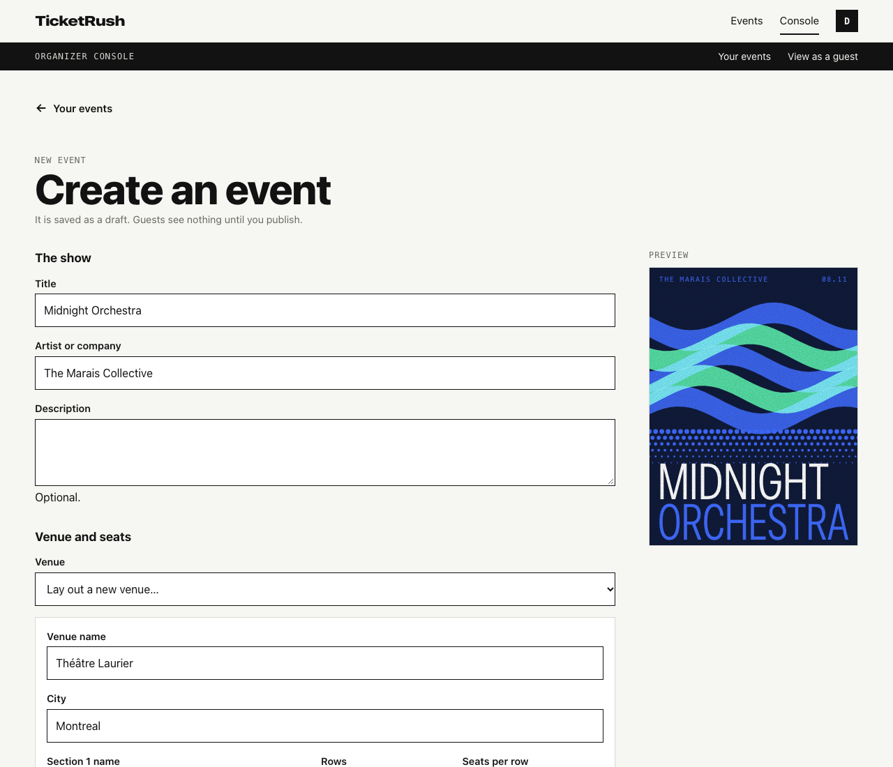
</p>

<p>
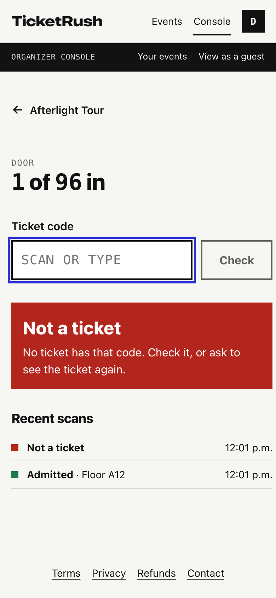
</p>

The dashboard shows revenue, seats sold and held, the people in the waiting room and the door count, to the cent and
refreshed every five seconds. The create form checks the server's rules before asking, keeps its draft if the sign-in
runs out, and shows the poster as you design it. The door scanner takes a keyboard-style reader or typed codes. See
[the console and deployment record](docs/adr/0007-organizer-console-and-deployment.md).

<p>
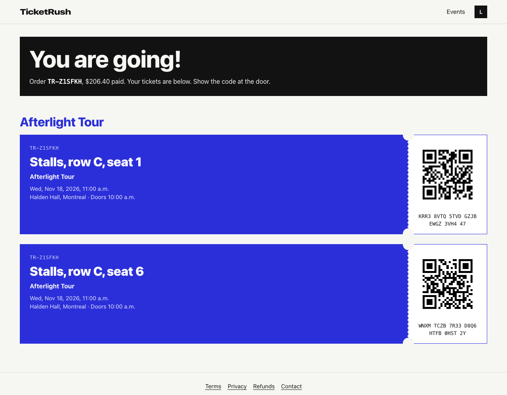
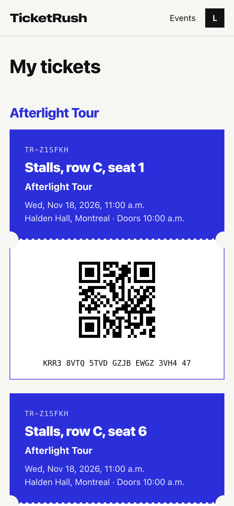
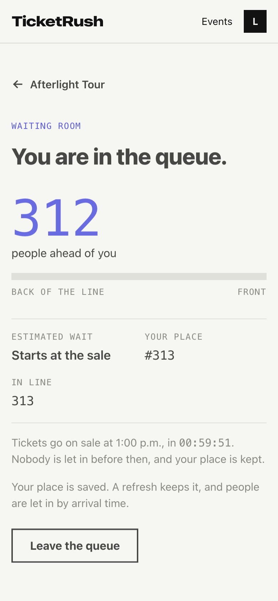
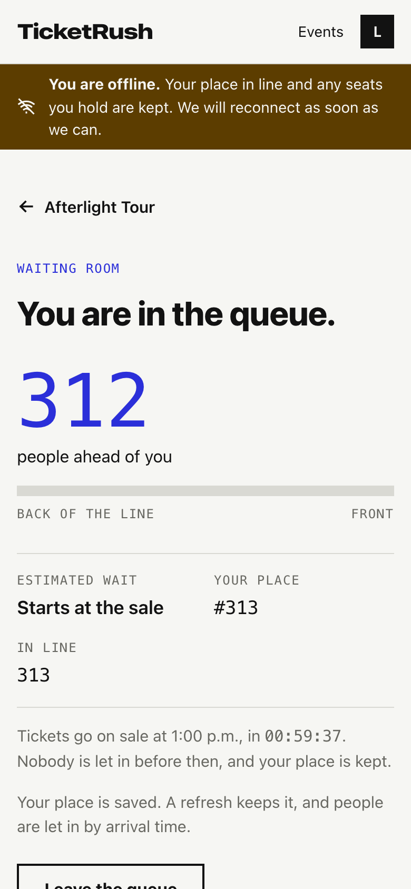
</p>

Posters are generated from each event's data, in six styles. Pages glide into each other (the poster travels from the card to the event page), and when something goes wrong the guest is told what happened, whether their place, seats or money are affected, and what to do next. The design decisions, and what testing in a real browser
found, are in [the web app decision record](docs/adr/0005-web-app.md) and [the motion and errors record](docs/adr/0006-motion-and-errors.md). The screenshots come from `npm run screenshots`.

## Proof

A 1,500-guest drop for 1,000 seats, through the waiting room, seat holds and payment, then the database is checked for broken invariants:

```bash
loadtest/run.sh drop     # k6 in Docker; ends with "0 invariant violations" or fails
```

- Exactly one of 1,000 guests wins a seat they all grab at the same instant, every time.
- No seat sold twice, no tickets without a paid order, and the payment provider's charges match the orders exactly, including abandoned holds, declined cards, provider errors and double-clicked payments.
- Guests are let in in the order they joined. The default drop runs in about 60 seconds with hold p95 of 3 ms on one laptop-sized container (2 CPUs, 1 GB), and 2,000 open place-in-line streams each get an update about every 1.2 seconds (configured: every second).

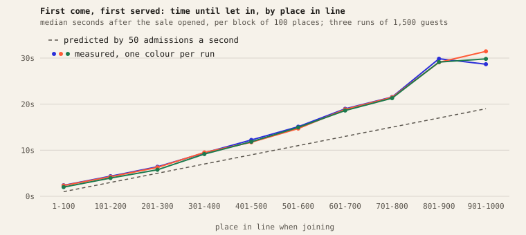

The conditions, the tables with ranges, what went wrong along the way and what is not covered are in [docs/performance.md](docs/performance.md); the method is in [the decision record](docs/adr/0004-load-testing.md). CI runs the smoke scenario and the same database check on every push.

## What exists so far

| Area | Detail |
|---|---|
| Sign-up and sign-in | `POST /api/auth/register`, `POST /api/auth/login`, `GET /api/me`. BCrypt passwords, 30 minute HS256 tokens. The app refuses to start without a 32+ character `JWT_SECRET` |
| Duplicate emails | Unique on lowercase email in the database. A test fires 8 simultaneous sign-ups for one email and expects exactly one to win |
| Venues | Organizers create a venue from sections x rows x seats and every seat is generated (rows A to Z, then AA). Capped at 5,000 seats |
| Events | Organizers create a draft with prices and a drop time, then publish. Publishing creates one inventory row per seat. It locks the event row, so 6 simultaneous publishes still create each seat exactly once |
| Prices | Whole cents. Guests see the all-in price: face plus a 7.5% fee, rounded half up, computed in one tested place. A $96.00 seat shows as $103.20 |
| Browsing | `GET /api/events` (filter by city and text, paged), `GET /api/events/{id}` (tiers, availability, sale state, server time), `GET /api/events/{id}/seats` (rows and seats with status). No sign-in needed |
| Sale state | `UPCOMING`, `QUEUE_OPEN`, `ON_SALE`, `ENDED`, derived from the clock and never stored. Responses include server time so a countdown cannot drift |
| Caching | The seat map is cached for 2 seconds in-process. Public GETs send `Cache-Control: max-age=5` and an ETag that answers 304 |
| Seat holds | `POST /api/events/{id}/holds` holds 1 to 6 seats for 10 minutes, all or nothing, with an itemised price (face, fees, total). `GET .../holds/me` shows your hold and `DELETE /api/holds/{id}` releases it. A new hold replaces your old one, and a failed one leaves the old one alone |
| No double holds | One conditional `SKIP LOCKED` claim in Postgres, see [the decision record](docs/adr/0001-seat-claims.md). Tests release 300 guests at one seat (exactly one wins) and 500 guests at overlapping pairs from 40 seats, then check the database: no seat in two holds, every hold holds what it says |
| Expiry | An expired hold frees its seats at once, with or without the background sweeper. Tested by moving the clock |
| Waiting room | Events can have a waiting room. Guests join with `POST /api/events/{id}/queue`, get an exact place (`GET .../queue`, or live over SSE at `.../queue/stream`), and are let in first come, first served at a steady rate with a cap on how many are inside. Refreshing or reconnecting keeps your place. See [the decision record](docs/adr/0002-waiting-room.md) |
| Admission | Admitted guests get a signed token. On a waiting-room event the hold endpoint refuses anyone without a valid one for that guest and that event, without touching Redis. Tests cover another guest's token, another event's, expired, tampered and a sign-in token |
| Queue under load | 200 guests joining at once get places 1 to 200 with no gaps or repeats. 8 admission rounds at the same instant admit exactly the cap and exactly the first guests in line. Several app instances share one round per second |
| Checkout | `POST /api/orders` with an `Idempotency-Key` header and `{holdId, paymentToken}` turns a hold into an order: 201 paid, 202 outcome unknown, 402 declined, 409 seats lost and refunded. Card details never reach the server, only a provider token. See [the decision record](docs/adr/0003-checkout-and-payments.md) |
| No double charge | Three layers: the idempotency key, one live order per hold, and an order-derived key at the provider. Tests send 10 identical requests at once (one order, one charge), 10 different keys for one hold (exactly one pays) and 5 guests paying for different holds together, then check the database |
| Unknown outcomes | A timeout is not a failure. The order stays pending with the seats held, a retry settles it without a second charge, and a reconciler looks up stuck charges at the provider. If the seats were lost while the charge ran, the guest is refunded and a failed refund is retried |
| Confirmations | Paying writes an outbox row in the same transaction. A relay delivers it to idempotent listeners: one confirmation message per order, and the guest's place in the waiting room is freed. A failing delivery is counted and retried, never lost |
| Tickets | `GET /api/tickets`, a QR code per ticket as SVG at `/api/tickets/{id}/qr.svg`, and organizer scanning at `POST /api/tickets/scan`. 20 scanners presenting one ticket at once admit it exactly once |
| Roles | Browsing is public. Creating venues and events is organizer only, and an organizer can only change their own events |
| Organizer console | `/api/organizer/**`: my events (drafts too), sales per section with revenue and door count, the waiting room's depth, every scan attempt. Ownership is checked on every route, and tests compare each number with direct SQL |
| Cancelling | Cancelling an event refunds every paid order once and voids the tickets (a refund that fails is retried; a guest already scanned in keeps their order). Drafts can be edited, and the organizer's list is paged. See [the decision record](docs/adr/0008-finishing-touches.md) |
| Sessions and bots | A sign-in is renewed while it is in use (up to eight hours after the password), sign-up can require a Cloudflare Turnstile check, and a scheduled check watches the live site |
| Email | A forgotten password is reset through a single-use link that expires in an hour, new guests confirm their address before joining a queue, and order confirmations and cancellation notices are sent by a relay that retries (Resend; off without a key). See [the decision record](docs/adr/0009-ready-for-the-public.md) |
| Payments | Mock provider by default; with a Stripe test key (`STRIPE_SECRET_KEY` and `VITE_STRIPE_PUBLISHABLE_KEY`) checkout uses Stripe's card form and API in test mode, with the same idempotency and refund guarantees. Live keys are refused. See [the decision record](docs/adr/0009-ready-for-the-public.md) |
| Your data | Terms, privacy and refund pages, a downloadable copy of your data, and closing your account (name and address removed, order records kept). See [the decision record](docs/adr/0009-ready-for-the-public.md) |
| Security checks | A test that every endpoint is open, guest-only or organizer-only and that the rules agree; a weekly and per-pull-request scan of dependencies, both images, the repository and the running app. See [the decision record](docs/adr/0009-ready-for-the-public.md) |
| Production | Sign-in and sign-up are rate limited per address, the first organizer comes from configuration, a `prod` profile closes the API docs, and the API has no public address on Fly. See [docs/deploy.md](docs/deploy.md) |
| Errors | RFC 7807 problem responses, with each invalid field listed |
| Architecture | ArchUnit tests enforce `api -> application -> domain` layering and no cycles between modules |
| Schema | Flyway migrations only. Hibernate runs in `validate` mode |
| Web app | Browse events, join the waiting room, pick seats, pay, and keep tickets with QR codes, on a phone or a laptop. Every state the backend can produce has a plain-words screen. See [the decision record](docs/adr/0005-web-app.md) |
| Accessibility | One tab stop on the seat map with arrow keys, taken seats announced as taken, errors linked to their fields, a visible hold timer, and an axe scan of every screen that must find nothing serious |
| Observability | Prometheus metrics on a separate port, and a provisioned Grafana dashboard: request rate and latency by endpoint, database pool pressure, JVM, holds by result, queue, orders by outcome, outbox backlog |
| Load tests | k6 scenarios for the whole drop, one hot seat, browsing and open live streams, each followed by a database check that must find 0 broken invariants. Results and conditions in [docs/performance.md](docs/performance.md) |
| CI | GitHub Actions builds, runs every test, reports coverage, and runs the smoke load test against a real app and database |
